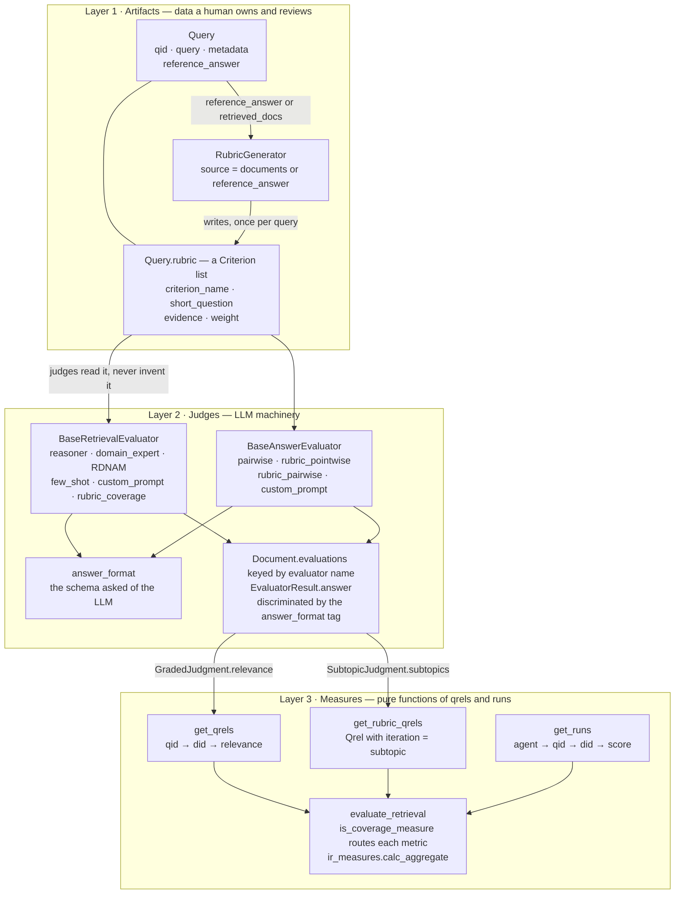

# Architecture

RAGElo separates evaluation into three layers. The split follows the TREC lineage
(`trec_eval` → `pytrec_eval` → `ir_measures`), where a judgment is inert data and a metric is a
pure function of qrels and runs, with no notion of who produced the labels.

1. **Artifacts** — the data an evaluation is grounded in: queries, reference answers, and the
   rubric a complete answer must satisfy. Owned, versioned and reviewed by a human. A judge must
   never be able to regenerate the artifact it is scored against, or the evaluation reduces to two
   LLM approaches agreeing with each other. Generators produce artifacts; they are not judges, and
   they run before judging rather than inside it.
2. **Judges** — read artifacts, ask an LLM, and write a typed judgment onto an evaluable. A judge's
   identity is its name, so adding one should be cheap.
3. **Measures** — turn judgments into numbers. They know about qrels and runs, never about which
   judge produced them.

Each crossing between layers is a declared contract rather than an inference, so that adding a
judge does not ripple into the metrics layer.

## The contracts

| crossing | contract | why it is not an inference |
|---|---|---|
| artifact → judge | `Query.rubric` | A rubric on the query is persisted, reviewable, and shared by every judge that grades against it, rather than being private to one evaluator instance. |
| generator → artifact | `RubricGenerator.generate_experiment` writing `Query.rubric` | Generation is a separate pass over the experiment, so a rubric can be inspected and edited between being written and being graded against. |
| artifact → judgment | `RubricJudgment.rubric_fingerprint` | A rubric judgment is only meaningful against the rubric it was made against. Recording which one lets an edit to a single query's rubric re-judge that query and nothing else, instead of forcing `force=True` over the whole experiment. |
| judge → LLM | `answer_format` on the evaluator | A result class is shared by every judge writing to the same evaluable, so its `answer` union says what it can *store*. Deriving the request schema from that union's first member would let a reordering change what the LLM is asked for. |
| judge → storage | the `answer_format` tag plus `Field(discriminator=...)` | Structural matching cannot separate formats where one declares a superset of another's fields, and it fails silently by dropping the surplus. |
| judgment → measure | `GradedJudgment` / `SubtopicJudgment` | The metrics layer asks a judgment what it contributes. A judge with a new payload needs no change in `get_qrels` or `get_rubric_qrels`. |
| judgment → aggregate | computed fields on the rubric answer formats | `average_score`, `agent_a_wins`, `winner` and `margin` are pure functions of the per-criterion verdicts, so a judge cannot store an aggregate that contradicts the criteria it recorded. They still serialize, so consumers read them as before. |

### Aggregates are derived, not judged

A judge records one verdict per criterion and nothing else. Everything above that (`average_score`
for pointwise, the win totals, `winner`, `margin` and `mean_confidence` for pairwise) is a
`@computed_field` over `criteria`.

That makes an inconsistent judgment unrepresentable, and it is what lets the built-in
evidence-recall and citation-quality checks be ordinary criteria carrying their configured weight,
rather than corrections applied to a finished score. `model_copy(update={"average_score": ...})` is
silently ignored on a computed field, so the only way to move an aggregate is to change the
criteria.

`ragelo/measures.py` holds the boundary to `ir_measures`: measure resolution, classification of which
measures read subtopic qrels, and construction of qrel and run rows. `ir_measures` is optional, so
that module is the only place that imports it.

### Coverage measures need subtopic qrels

`StRecall`, `alpha_nDCG`, `NRBP` and `nNRBP` score how much of a query's information need a ranking
collectively covers. They need to know which criterion each document addresses, which flat qrels
cannot express: those hold one relevance value per document. `get_rubric_qrels` puts the criterion
name in the `iteration` field, which is where `ir_measures` looks for a subtopic id. Encoding it in
the query id instead produces `WARNING: All queries have only 1 subtopic!` and invalid numbers.

These measures also require `pip install 'ragelo[eval]'`, which pulls `ir-measures[pyndeval]`;
without `pyndeval` they appear in the `ir_measures` registry but are unsupported.

## Where the layers still leak

- **No artifact-preparation phase.** Both rubric evaluators override `evaluate_async` — which the
  contributor guide says to do "almost never" — to generate a missing rubric before judging. Running
  `RubricGenerator.generate_experiment` first makes the override dead weight, but nothing yet
  requires that order, so the lazy path has to stay.
- **The built-in judge prompts ignore `Query.reference_answer`.** A gold answer reaches `reasoner`
  and `domain_expert` only through a `{{ query.metadata.<key> }}` convention in a custom prompt.
- **`RDNAMEvaluator` mutates `self.result_type`** inside `_process_answer` to choose its output class,
  while `_run_evaluations` fans out concurrent coroutines against the same evaluator object.
